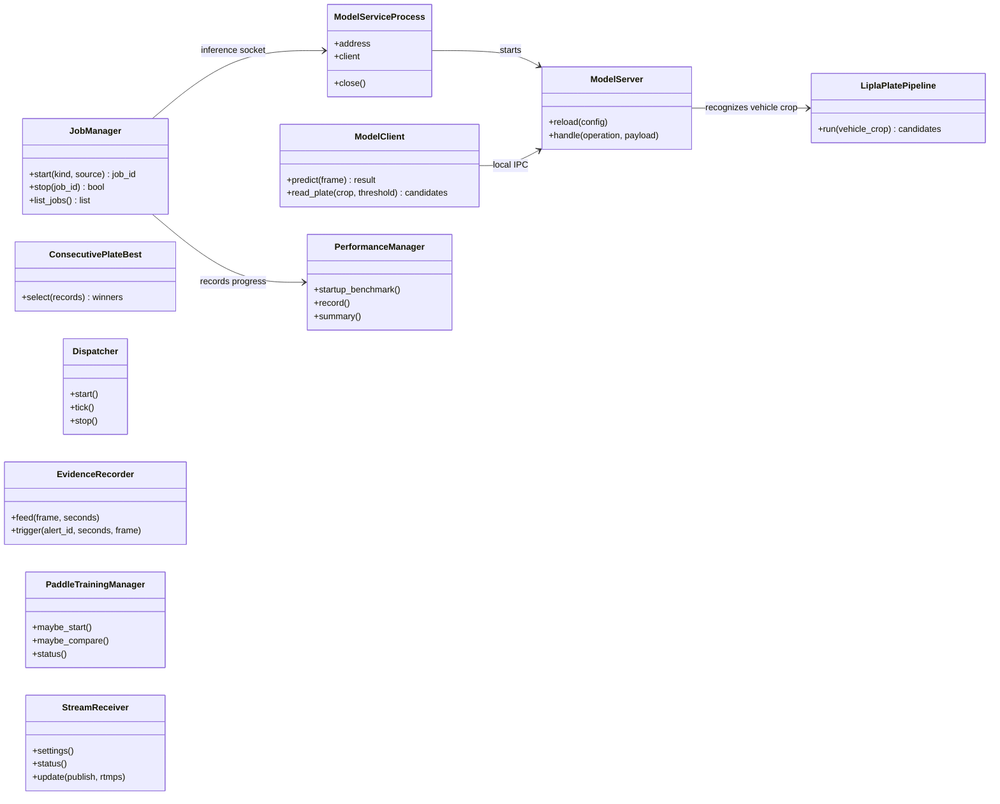
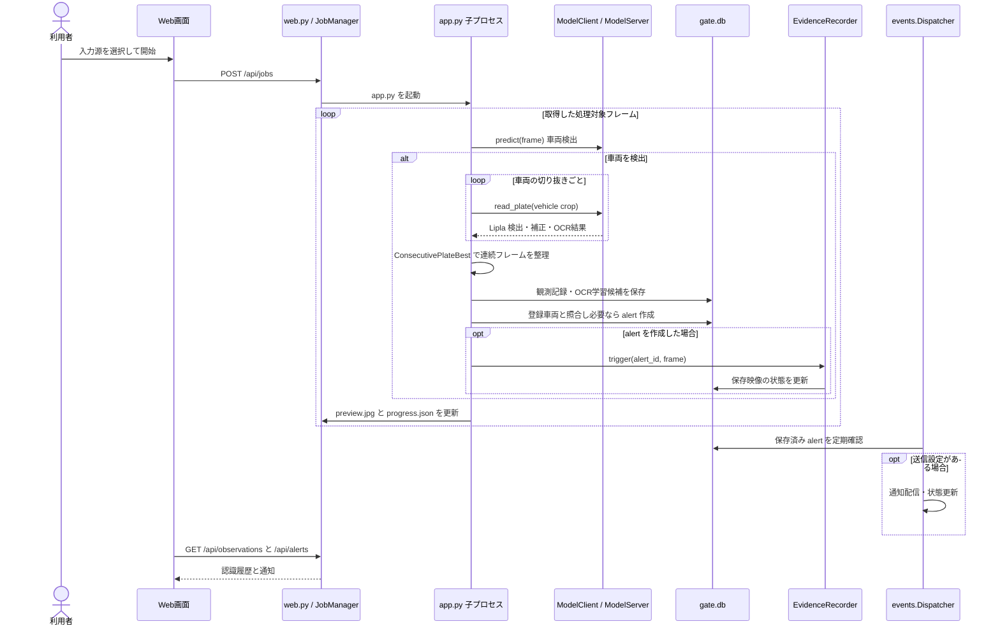
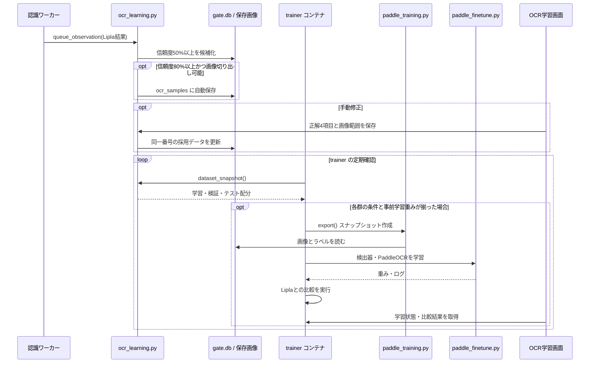
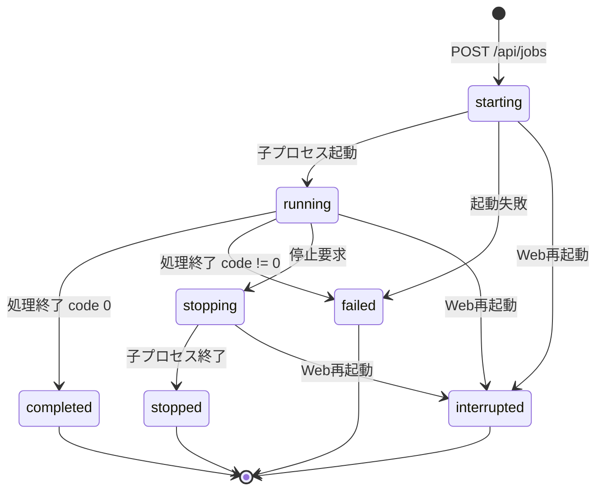
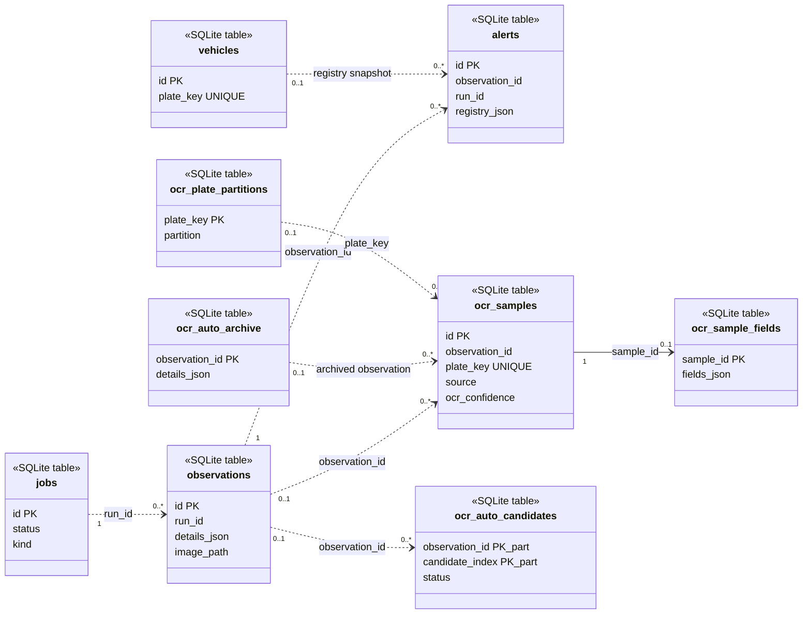
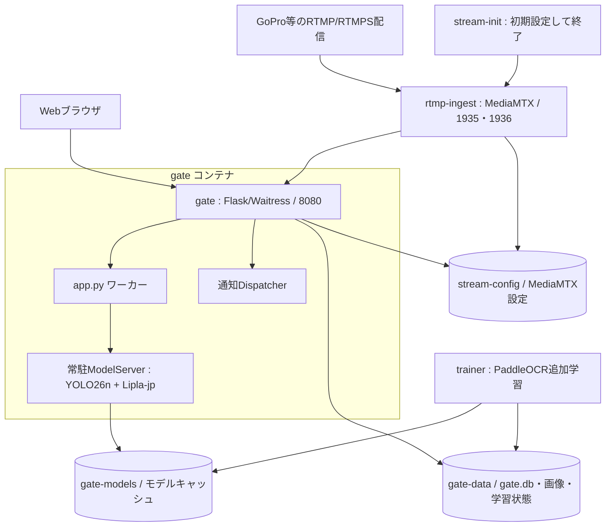

# AI Gate System 現行実装のUML

2026年9月30日時点の `main` の Python、Web画面、`onprem/compose.yaml` をリバースエンジニアリングして作成した図です。図の矢印はコード上の呼び出し・保持関係を表します。図中の「学習」は運用の推論経路から独立しています。

## 1. 主要クラスと依存関係（クラス図）

`JobManager` が `app.py` を子プロセスとして起動し、子プロセスの `ModelClient` が常駐 `ModelServer` とローカルソケットで通信します。`PaddleTrainingManager` は保存済みの Lipla 認識結果を読み、Lipla の実行クラスを直接呼び出しません。`Dispatcher` と `EvidenceRecorder` は `alerts` テーブルを介して連動します。これらの処理順序を次の図に示します。

## 2. 入力から通知まで（シーケンス図）

運用OCRは `lipla_pipeline.py` の Lipla-jp ネイティブ処理です。専用検出器と PaddleOCR を組み合わせるコードは検証・学習用に残っていますが、この運用シーケンスのモデルには含めません。連続フレームで同じプレートの場合、最も信頼度の高い記録が残るよう既存記録を更新します。通知イベントの配信は設定に応じた別処理で、Web画面は保存された `alerts` を読みます。Lipla 内部の検出・補正・OCRは一回の呼び出しで実行するため、計測できるのはその合計時間です。

## 3. OCR学習と評価（シーケンス図）

信頼度98%以上の Lipla の仮ラベルまたは手動の正解が検証・テスト対象になります。配分は `dataset_snapshot()` が対象全体の番号を約1対1に振り分けます。学習の結果は比較画面へ出ますが、運用モデルを自動で置き換えません。Lipla の自動ラベルでの比較は、人手で独立に確認した正解率を示すものではありません。

## 4. ジョブ状態（状態図）

起動時にDB内に残っている `starting`・`running`・`stopping` は `interrupted` に更新されます。これはジョブの保存状態の図であり、学習ジョブの状態とは別です。

## 5. 保存データ（クラス図として表現したテーブル関係）

点線は識別子または保存時スナップショットによる**論理的な関連**です。SQLite 外部キー制約を表していません。履歴は最新100観測を保持し、必要な学習画像は別途アーカイブします。車両登録 (`vehicles`) とOCR教師データ (`ocr_samples`) は独立しています。

## 6. 配置構成図（補助図）

`onprem/compose.yaml` の起動構成は `gate`、`trainer`、`rtmp-ingest`、初期化後に終了する `stream-init` です。`trainer` は `linux/amd64` 指定で、読み取り専用のローカル `PaddleOCR` ソースもマウントします。ブラウザ側のページはライブ監視、RTMP設定、通知、登録・確認、OCR学習、履歴、システム性能に分かれています。図のポート表記はコンテナ側の値で、ホスト側の公開アドレスは環境変数に従います。

## 調査元と更新方法

- `web.py`: API、ジョブ起動、ModelServiceProcess、通知Dispatcher
- `app.py`、`model_service.py`、`lipla_pipeline.py`: 推論経路と常駐モデル
- `events.py`、`evidence.py`: 登録照合、通知保存、映像保存
- `ocr_learning.py`、`paddle_auto_worker.py`、`paddle_auto_train.py`、`paddle_training.py`: 教師データと学習
- `onprem/compose.yaml`、`templates/index.html`: コンテナと画面

UMLの元データはこのMarkdown内の Mermaid です。GitHub上で図として表示でき、ソースを編集して実装変更に追随できます。配置図の標準的なUML表記は [deployment.puml](deployment.puml) に保存しています。最初に `web.py:create_app` と `app.py:main` の呼び出し先を再確認し、次にテーブル定義と Compose のサービス定義を更新してください。リバースエンジニアリングによる静的な図であり、コンテナを起動して計測した結果ではありません。
